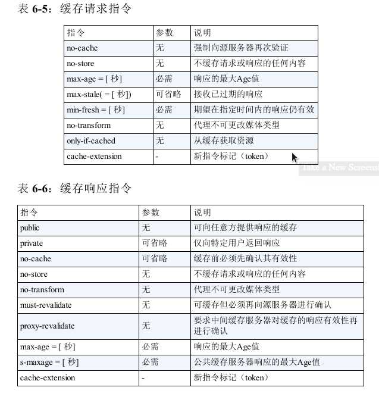
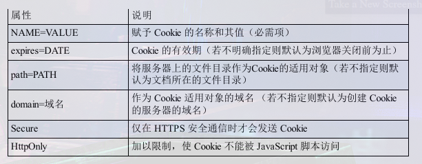

### **HTTP首部**

HTTP/1.1规范定义了47种首部字段。

**Cache-Control指令一览**

Cache-Control指令的参数是可选的，多个参数之间可以通过','分割。

所有缓存指令如下：

no-cache和no-store的区别：从字面意思上很容易将no-cache理解为不缓存，实际上no-cache代表不缓存过期的资源，缓存会向源服务器有效期确认后处理资源。no-store才是真正的不进行缓存。

#### **Connection**

有两个作用：

- 控制不再转发给代理的首部字段
- 管理持久连接

#### **请求首部字段**

- Accept：通知服务器，用户代理能够处理的媒体类型及媒体类型的相对优先级。
- Accept-Charset：通知服务器用户代理支持的字符集
- Accept-Encoding：用户代理支持的内容编码
- Authorization：告知服务器用户代理的认证信息。当服务器需要认证信息，客户端没有时，返回401状态码
- Except：使用Except来告知服务器，期望出现的某种特定行为。
- From：用来告知服务器使用用户代理的用户的电子邮件地址。
- Host：可能存在多个域名绑定一个IP地址，所以需要Host来进一步识别
- If-Match：属于附带条件之一，它会告知服务器匹配资源所用的实体标记（ETag）值。
- If-Modified-Since：如果在指定日期之后更新了，服务器才会接受。

#### **响应首部字段**

- Accept-Ranges：告知客户端服务器是否能处理范围请求
- Age：告知客户端源服务器在多久前创建了响应
- ETag：告知客户端实体（即服务器上的资源）标识，将服务器的所有资源以字符串的形式告知客户端。ETag由服务器分配，并没有统一的分配算法
  - 强Etag：无论实体发生多么微妙的变化都会改变ETag值
  - 弱ETag：只有资源发生了根本改变，产生差异时才会改变ETag值。这时会在字段值最开始处附加W/
- Location：配合3XX：Redirection使用，将响应接收方引导至另一个页面。
- Retry-After：告诉客户端多久后才发送请求。日期格式可以是多少秒后，也可以是具体的日期时间
- Server：告诉客户端，服务端安装的HTTP服务器应用程序信息
- Vary：Vary字段可以指定一些首部字段，当缓存中存在与Vary参数相同的字段的响应时，就直接从缓存中返回。否则必须从源服务器重新获取资源。

#### **实体首部字段**

实体首部字段是包含在请求报文和响应报文中的实体部分所使用的首部，用于补充内容的更新时间等与实体相关的信息。

- Allow：通知客户端支持的HTTP方法
- Content-Encoding：告知客户端实体的编码方式
- Content-Length
- Content-Language
- Content-MD5：客户端对接受的报文主体执行相同的MD5算法，然后与Content-MD5的字段值进行比较
- Content-Range
- Content-Type
- Expires：客户端将资源失效的日期告知客户端
- Last-Modified：上次更改的日期

#### **为cookie服务的首部字段**

- Set-Cookie

  

### **更安全的HTTPS**

HTTP + 加密 + 认证 + 完整性保护 = HTTPS

- 加密：HTTPS使用SSL或TLS对通信内容进行加密
- 认证：SSL不仅提供加密处理，而且还使用了一种被称为证书的手段。证书由值得信任的第三方机构办法，证明服务器和客户端是存在的。而伪造证书在技术角度来看非常困难。
- 完整性保护：通过MD5和SHA-1等散列值校验的方法检验传输的数据是否完整。如果不完整，则很可能被篡改了。

**非对称的加密方式**

在非对称的加密方式中，有一对非对称的密钥。一把用来加密，另一把用来解密。用来加密的密钥可以网络上分发，用来解密的密钥则自己留着用来解密其它机器发过来的消息。

**证明公开密钥正确性的证书**

非对称加密方式还有最后一个问题，那就是无法证明发送端拿到的接收端的公开密钥是货真价实的密钥。如果使用了被篡改的公开密钥，那么就会被篡改者使用自己的私钥进行解密了。

为了解决这个问题，可以使用由数字证书认证机构（Certificate Authority，CA）颁发的公开密钥证书。但是CA机构将这个公开密钥证书发送给客户端也是不安全的，所以多数浏览器开发商都会事先在内部植入常用认证机关的公开密钥。