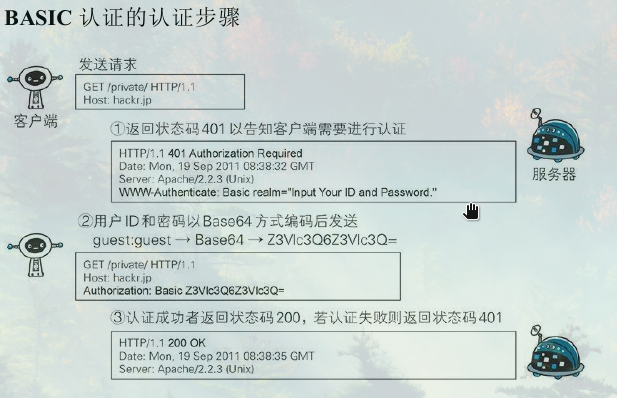
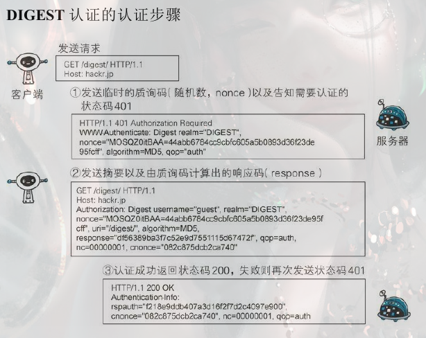

### 确认访问用户身份的认证

HTTP/1.1使用的认证方式有：

- BASIC认证（基本认证）
- DIGEST认证（摘要认证）
- SSL 客户端认证
- FormBase 认证（基于表单认证）

#### **BASIC 认证**

认证步骤：

1. 客户端在访问需要认证的资源时，服务器发送401状态码要求认证。在WWW-Authenticate字段存在认证方式和安全域字符串（realm）
2. 用户发送ID和密码，两者通过":"连接，然后经过Base64编码，存储在首部字段Authorization，该字段还包括了认证方式。
3. 服务器接收到字段后进行验证，验证成功后就返回200 OK。

由于BASIC只是采用Base64进行编码，并没有加密，所以不够安全

#### **DIGEST认证**

认证步骤：

1. 服务器发送质询时在WWW-Authenticate字段内会附加临时质询码（随机数，nonce）和realm信息。客户端依靠向服务器回送这两个值进行认证。

   nonce是一种每次返回的401响应生成的任意随机字符串。通常由Base64编码的十六位进制数组成。

2. 客户端返回的响应必须包含用于DIGEST认证的Authorization字段信息。

   username是realm限定范围内的可进行认证的用户名

   response存放经过MD5运算后的密码字符串，形成响应码

3. 服务端确认信息的正确性后会在首部字段Authentication-Info字段写入一些认证成功的信息

#### **SSL客户端认证**

SSL客户端认证是借由HTTPS的客户端证书完成认证的方式。凭借客户端证书认证，服务器可确认访问是否来自自己登录的客户端。

**认证步骤：**

为达到SSL客户端认证的目的，需要事先将客户端证书分发给客户端，且客户端必须安装此证书。

1. 服务器发送certificate request的报文
2. 客户端选择将发送的客户端证书后，客户端会把客户端证书信息以client Certificate的报文形式发送给服务器
3. 服务器验证客户端证书验证通过后可领取证书内客户端的公开密钥，然后开始HTTPS加密通信。

#### **基于表单认证**

多数情况下，web认证多为表单认证。

**Session管理及Cookie应用**

1. 客户端把用户ID和密码等登录放入报文的实体部分，以POST方法发送给服务器
2. 服务器发放泳衣识别用户的SessionID，将用户的认证状态与SessionID绑定后记录在服务器端
3. 客户端接收到从服务器端发来的SessionID后，会将其作为Cookie保存在本地，下次向服务器发送请求时，浏览器就会自动发送cookie

### **基于HTTP协议追加的协议**

HTTP的瓶颈：

- 一条连接只能发送一个请求
- 请求只能从客户端开始，客户端不能接收除响应以外的指令
- 请求/响应首部未经压缩就发送，首部信息越多延迟越大。
- 发送冗长的首部，每次互相发送相同的首部造成的浪费较大。

#### **Ajax的出现**

Ajax（Asynchronous JavaScript and XML）是一种有效利用JavaScript和DOM（Document Object Model）的操作。Ajax的核心技术是名为XMLHTTPRequest的API，通过JavaScript脚本语言的调用就能和服务器进行HTTP通信。借用这种手段，就能从已经加载完毕的web页面发起请求，只更新局部页面。

但是Ajax实时地从服务器获取内容，可能会导致大量请求产生。

#### **Comet**

一旦服务器端有内容更新了，comet不会让请求等待，而是直接给客户端返回响应。通常，服务器端收到请求，在处理完毕后会立即返回响应，但为了实现实时推送，comet会先将响应置于挂起状态，当服务器端有内容更新时，再返回响应，就可以立即反馈给用户。

内容虽然做到了实时更新，但是为了保留响应，一次连接的持续时间变长，消耗的资源更多了。